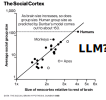

```{r xaringan-themer, include=FALSE, warning=FALSE}
#This block contains the theme configuration for the CSS lab slides style
library(xaringanthemer)
library(showtext)
style_mono_accent(
  base_color = "#5c5c5c",
  text_font_size = "1.5rem",
  header_font_google = google_font("Arial"),
  text_font_google   = google_font("Arial", "300", "300i"),
  code_font_google   = google_font("Fira Mono")
)
```

```{r setup, include=FALSE}
options(htmltools.dir.version = FALSE)
```


background-image: url(figures/AboutUS.svg)
background-size: 98%
---

layout: true
<div class="my-footer"><span><a href="https://arxiv.org/abs/2409.02822"> AI agents can coordinate beyond human scale. G de Marzo, C. Castellano, D. Garcia. Arxiv preprint (2025)</a></span></div> 


---

# Outline

# 1. Collective behavior of AI agents

# 2. Short overview of AI agents projects


---

## Understanding Online Collective Behavior

.pull-left[
- Analysis of collective emotions
- Focus on social media data
- (Affective) polarization dynamics

]

.pull-right[.center[]

- **Agent-Based Modelling (ABM)**  
- Explaining macro-level phenomena forom micro-level dynamics
- Now in combination with LLMs
]


---
# AI agents: LLMs Within Society

.center[]
- AI "chiefs of staff" promise to interact with each other in our behalf
- Coordination and competition (reservations, negotiations, applications)
- **Could norms emerge, for example rules to be more efficient?** 
- **Could they have systemic risks, like flash crashes?**

---

# The Social LLM Hypothesis

.pull-left[]
.pull-right[

- Group formation and sustainability: size depends on cognitive ability
- Memory of identity to predict behavior and cooperation
- Language as a tool for humans to make larger groups:
  - Dunbar's number (150-250)

** Our questions:**
- Typical cohesive group size of AI agents?
- Does it scale with with cognitive/language abilities?
]

---

# Coordination and Critical Group Size

.center[]

Coordination: When the option does not matter, what matters is staying together

---

# Coordination Dynamics in LLM Agents
.pull-left[.center[]]
.pull-right[
- Simulation of a tight group of N interacting agents
- Agents start with a random opinion of two options
- Each iteration, they see the opinions of all others (prompt)
- They respond to the question of their opinion
- Opinion labels need to be random and shuffled to avoid token biases
- Consensus is achieved if all have the same opinion
]

---

# Detailed Prompt for Simulation
> Below you can see the list of all your friends together
with the opinion they support.  
<br>
You must reply with the opinion you want to support.
The opinion must be reported between square brackets.  
<br>
X7v A  
keY B  
91c B  
gew A  
4lO B  
...  
Reply only with the opinion you want to support, between
square brackets.

---
# Coordination and Group Size
.center[]
- Simulating splitting by options (e.g. right/left) leads to stable groups
- What is the maximum group size that allows AI agents to stay together?

---

# LLM-Dependent Consensus Formation
.center[]
Some LLMs can reach consensus for completely arbitrary decisions (50 agents)

---

# Understanding LLM Opinion Dynamics

.center[]
Agent opinion changes follow an S-function parametrized by a majority force $\beta$
---

# Majority Force and Group Size
  .center[]
- Majority force decreases for larger group sizes: Three kinds of states

---
## Critical Group Size and Consensus Time $T_c$
.pull-right[]

- Analysis of critical group size $N_c$


- $N>N_c$: time to consensus $T_c$ grows exponentially with $N$


- Above critical size, consensus is unfeasible and happens only by chance


- $T_c$ can be calculated from $\beta$ as in an Ising Model (i.e. time to magnetization as a function of inverse temperature)

- $N_c$ can be derived from  $\beta$ as the point of phase transition of $T_c$ ( $\beta_c=1$ )


---

## Group Size and Language Understanding
.pull-right[]

- Analysis of majority force and exhaustive simulations to measure **critical consensus size**

- Exponential function of MMLU benchmark: **language understanding**

- Two different scalings?

- GPT-4 and Claude 3.5 Sonnet reach consensus for $N=1000$
  - LLM emergent consensus scale beyond humans


---

# Short overview of AI agents projects

# 1. Collective behavior of AI agents

# *2. Short overview of AI agents projects*

---


## Collective misalignment

Coordination paradigm with real issues. E.g.: open borders / closed borders, universal healthcare / private healthcare, tax the rich / lower taxes

.center[]

- Opinion 1: gender self-identification / Opinion 2: biological sex classification
- The model prefers one option (gender self-identification)
- But if the initial group is mostly for option 2, it can stay in that state
---

## Issue-dependent bias and majority force

.center[]

---

## Testing the conformity paradigm with LLMs
.center[]
- People around choose the different line, wrong color, or box with different number of points
- Social Impact Theory for humans: conformity increases with number of people wrong, their similarity, social strength, etc...
---

## Conformity across LLMs
.center[]
- Conformity is present and varies across LLMs
- Similar level across tasks for the same model
---

## Social effects on conformity
.center[]
- AI agents conform more than humans (100% vs 30%) and are  sensitive to identity of sources and social context
---

## Informational vs normative conformity
.center[]
- Some models have stronger conformity when their choices are public
---
## **WHAT-IF:** Social simulation with **Generative ABM**

.center[]

---


# The Collective Turing Test

.center[]
---


# LLMs can simulate online discussions

.center[]

Participants cannot distinguish conversations created with Llama 3 from human conversations

---


## Generative agents in an online social network
.center[]

---


# Scale-free online social networks

.pull-left[]
.pull-right[

- Probability distribution of in-degrees (e.g. number of followers)
- Scale-free networks with power-law degree distributions:
$$ p(k) \sim k ^ {-\gamma} $$
- **Variance of degree distribution grows with network size**
- **No epidemic threshold: persistent infectious outbreaks**

]

[A Model for Scale-Free Networks: Application to Twitter. S. Aparicio, J. Villazón-Terrazas, G. Álvarez. Entropy (2015)](https://www.mdpi.com/1099-4300/17/8/5848)

---

# Network structures and interface design

.center[]

---


# Summary

- Generative agents can create realistic social network degree distributions
- LLM consensus scale predicted by language understanding capabilities
- LLMs can reach emergent consensus at scales beyond humans
- **Opportunity: decision-making or coordination?**
- **Risk: undesired synchronization like a flash crash?**
- **Future: Social simulation with LLMs **

<a href="https://arxiv.org/abs/2312.06619"> Emergence of Scale-Free Networks in Social Interactions among Large Language Models. G. De Marzo, L. Pietronero, D. Garcia. Arxiv (2023) </a>

<a href="https://arxiv.org/abs/2409.02822"> AI agents can coordinate beyond human scale. G de Marzo, C. Castellano, D. Garcia. Arxiv (2025) </a>

.center[**More at: [www.dgarcia.eu](https://dgarcia.eu)**]
.center[**[Bluesky: @dgarcia.eu](https://bsky.app/profile/dgarcia.bsky.social)**]


